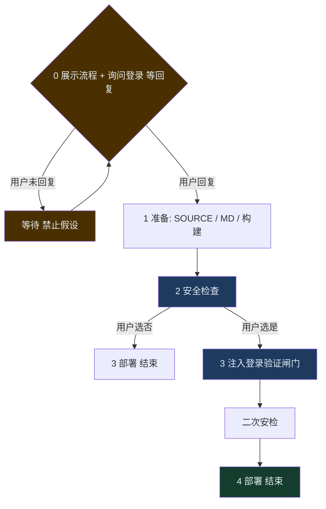

# Skill: HTML 文件内网部署

## 【强制规则】执行前必读

1. **自动检测部署源，禁止询问路径**：触发后立即用 `pwd` 获取当前工作目录作为默认 SOURCE，不得询问用户"要部署哪个目录"或"请提供路径"。
2. **始终部署完整项目目录**：若 SOURCE 为目录，部署整个目录；若根目录有 `index.html`，以它为入口；不得假设 README.md / README.html 是主要内容，也不得只上传 README。
3. **index.html 验证**：部署成功后，curl 访问地址验证返回 200，确认 index.html 可正常访问。

---

## 第一步：展示流程 + 询问登录（必须在任何操作之前）

触发后、执行任何操作之前，**先查询历史记录判断是否为重复部署**：

```bash
python3 -c "
import json, os, sys
f = os.path.expanduser('~/.demo-tap4fun-history.json')
source = sys.argv[1]
if os.path.exists(f):
    with open(f) as fp:
        records = json.load(fp)
    matches = [r for r in records if r.get('source') == source]
    if matches:
        last = sorted(matches, key=lambda r: r['time'])[-1]
        print(json.dumps(last))
        sys.exit(0)
print('NOT_FOUND')
" "<SOURCE_ABS>"
```

- 若输出为 `NOT_FOUND`（首次部署）→ 展示流程概览并询问登录，等待用户回复「是」或「否」后继续。
- 若找到历史记录（重复部署）→ **跳过询问**，直接沿用历史记录中的 `login` 值，告知用户「检测到该项目已部署过，沿用上次登录设置（是/否），直接开始部署」，进入步骤 1。

**首次部署时**，向用户展示以下流程概览并等待回复：

> 📋 **部署流程概览**
>
> 1. **准备**：确认部署源（如为 MD 会先转 HTML；如需构建会先执行 build）
> 2. **安全检查**：扫描待部署文件，确认无硬编码凭证、密钥等风险
> 3. **部署上线**：上传文件并生成 `https://demo.tap4fun.com/...` 访问地址
>
> 是否需要为此页面接入登录验证？请回复 **是** 或 **否**。
> - 选「否」→ 直接走上述流程
> - 选「是」→ 部署前会自动注入登录验证，访问页面需内网账号登录

**首次部署：必须等待用户明确回复「是」或「否」，不得假设，不得代答，不得跳过。**

收到用户回复后，记住用户的选择，进入步骤 1。

---

## 总流程（必须严格按序）



**核心约束：**
1. 未收到用户明确「是/否」回复不得执行任何后续步骤。
2. 接入登录**不需要**调用 `automation/add`，也不需要先部署——直接注入登录验证闸门，一次部署完成。
3. 禁止代答「是/否」。

## 登录服务端点（所有 demo 项目通用，勿修改）

| 用途 | 地址 |
|------|------|
| 校验登录态 | `https://demo.tap4fun.com/demo-auth/verify` |
| 发起登录 | `https://demo.tap4fun.com/demo-auth/login` |
| 退出登录 | `https://demo.tap4fun.com/demo-auth/logout` |

> 登录态通过 httpOnly Cookie（`demo_session`）维护，作用域覆盖所有 `.tap4fun.com` 子域。用户登录一次后访问其他 demo 页无需重复登录。
>
> 登录服务为独立 Python 服务，部署在 172.20.90.123:9259，通过 nginx `/demo-auth/*` 反代对外暴露，**无需改动 loginpass-bff**。

## 触发条件
当用户输入以下内容时触发：
生成预览地址 | 生成访问地址 | 生成地址 | 生成链接 | 生成 URL | 发布到 demo | 部署到 demo | 上传到 demo

**【历史查询触发词】**：查看 demo 列表 | 我的 demo | 已发布的 demo | demo 历史 | 已上传的 demo | 看看我发过哪些 demo
→ 触发后执行「查看历史部署」流程，**不走**部署流程。

## 接口与前置

- 单文件：`POST /upload/<target_dir>`；目录：`POST /upload-folder/<target_dir>`；格式：`multipart/form-data`
- 访问地址：`https://demo.tap4fun.com/`；需 curl、tar（macOS/Linux/Windows 10+ 自带）
- **禁止向用户展示内网 IP/端口，只展示 `https://demo.tap4fun.com/...`**

## MD 文件处理

`.md` 文件需先转为 HTML 再部署。**禁止使用 CDN**（内网无法访问 cdn.jsdelivr.net）。必须生成纯静态 HTML，内容直接写入 `<body>`；若用 marked.js 客户端渲染，**必须将 marked.min.js 内联到 HTML**，禁止 `<script src="https://cdn...">` 外链。

**Step A**：Read 读取 `.md` 全文。

**Step B**：优先用 Python + markdown 库做服务端转换（无 CDN 依赖）。**禁止创建 .py 文件**，用 `python3 -c '...'` 执行下方脚本（在 `import sys` 后插入 `sys.argv = ['', '<MD绝对路径>']`）。未安装则 `pip3 install markdown`。

```python
import sys, os, json
try: import markdown
except ImportError: os.system("pip3 install markdown -q"); import markdown
md_path = sys.argv[1]
with open(md_path, "r", encoding="utf-8") as f: md_content = f.read()
html_body = markdown.markdown(md_content, extensions=["tables", "fenced_code"])
title = os.path.splitext(os.path.basename(md_path))[0]
html_path = os.path.splitext(md_path)[0] + ".html"
md_js = json.dumps(md_content)
dl_btn = f'<a id="dl-md" href="#" style="position:fixed;top:12px;right:12px;padding:6px 12px;background:#0366d6;color:#fff;border-radius:4px;text-decoration:none;font-size:14px">下载 MD</a>'
dl_script = f'''<script>var m={md_js};document.getElementById("dl-md").onclick=function(e){{e.preventDefault();var b=new Blob([m],{{type:"text/markdown"}});var a=document.createElement("a");a.href=URL.createObjectURL(b);a.download="{title}.md";a.click()}}</script>'''
template = f'''<!DOCTYPE html><html lang="zh-CN"><head><meta charset="UTF-8"/><meta name="viewport" content="width=device-width,initial-scale=1.0"/><title>{title}</title><style>*,*::before,*::after{{box-sizing:border-box}}body{{font-family:-apple-system,BlinkMacSystemFont,"Segoe UI",Roboto,sans-serif;line-height:1.7;color:#24292e;background:#fff;margin:0;padding:0}}#content{{max-width:860px;margin:0 auto;padding:48px 32px 80px}}h1,h2,h3,h4,h5,h6{{font-weight:600;line-height:1.3;margin-top:1.5em;margin-bottom:.5em}}h1{{font-size:2em;border-bottom:1px solid #eaecef;padding-bottom:.3em}}h2{{font-size:1.5em;border-bottom:1px solid #eaecef;padding-bottom:.3em}}a{{color:#0366d6;text-decoration:none}}a:hover{{text-decoration:underline}}code{{background:#f6f8fa;padding:.2em .4em;border-radius:3px;font-size:.9em;font-family:Consolas,monospace}}pre{{background:#f6f8fa;border-radius:6px;padding:16px;overflow:auto}}pre code{{background:none;padding:0;font-size:.85em}}blockquote{{margin:0;padding:0 1em;color:#6a737d;border-left:4px solid #dfe2e5}}table{{border-collapse:collapse;width:100%;margin:1em 0}}th,td{{border:1px solid #dfe2e5;padding:8px 12px}}th{{background:#f6f8fa;font-weight:600}}tr:nth-child(even) td{{background:#fafbfc}}img{{max-width:100%}}hr{{border:none;border-top:1px solid #eaecef;margin:2em 0}}</style></head><body>{dl_btn}<div id="content">{html_body}</div>{dl_script}</body></html>'''
with open(html_path, "w", encoding="utf-8") as f: f.write(template)
print(html_path)
```

**备用 A**：Python 不可用时，直接根据 MD 内容生成静态 HTML（标题、代码块、列表、表格等转为对应标签），写入 `<body>` 内 `#content`，**右上角含「下载 MD」按钮**（Blob + download 触发下载原始 .md），禁止外部 script/CDN。

**备用 B（marked.js 客户端渲染）**：若需用 marked.js 渲染，**必须将 marked.min.js 内联**，禁止外链 CDN。转换时用 `curl -sS "https://cdn.jsdelivr.net/npm/marked/marked.min.js"` 拉取内容（沙箱可访问），嵌入 `<script>...</script>`，MD 原文放入 `marked.parse()` 渲染。示例：

```python
import sys, os, json, urllib.request
# 执行时插入: sys.argv = ['', '<MD绝对路径>']
md_path = sys.argv[1]
with open(md_path, "r", encoding="utf-8") as f: md_content = f.read()
title = os.path.splitext(os.path.basename(md_path))[0]
html_path = os.path.splitext(md_path)[0] + ".html"
md_js = json.dumps(md_content).replace("</script>", "<\\/script>")
marked_js = urllib.request.urlopen("https://cdn.jsdelivr.net/npm/marked/marked.min.js").read().decode().replace("</script>", "<\\/script>")
dl_btn = '<a id="dl-md" href="#" style="position:fixed;top:12px;right:12px;padding:6px 12px;background:#0366d6;color:#fff;border-radius:4px;text-decoration:none;font-size:14px">下载 MD</a>'
style = "*,*::before,*::after{box-sizing:border-box}body{font-family:-apple-system,sans-serif;line-height:1.7;color:#24292e;max-width:860px;margin:0 auto;padding:48px 32px}h1,h2,h3{font-weight:600;margin-top:1.5em}a{color:#0366d6}code{background:#f6f8fa;padding:.2em .4em;border-radius:3px}pre{background:#f6f8fa;padding:16px;overflow:auto}table{border-collapse:collapse;width:100%}th,td{border:1px solid #dfe2e5;padding:8px 12px}"
template = f'''<!DOCTYPE html><html lang="zh-CN"><head><meta charset="UTF-8"/><meta name="viewport" content="width=device-width,initial-scale=1.0"/><title>{title}</title><style>{style}</style></head><body>{dl_btn}<div id="content"></div><script>{marked_js}</script><script>var m={md_js};document.getElementById("content").innerHTML=marked.parse(m);document.getElementById("dl-md").onclick=function(e){{e.preventDefault();var b=new Blob([m],{{type:"text/markdown"}});var a=document.createElement("a");a.href=URL.createObjectURL(b);a.download="{title}.md";a.click()}}</script></body></html>'''
with open(html_path, "w", encoding="utf-8") as f: f.write(template)
print(html_path)
```

**Step C**：同目录生成同名 `.html`，作为部署目标继续流程。

---

## 执行流程（与总流程编号对应）

> ⚠️ **严格按顺序执行，每步完成前不得跳到下一步。**

### 步骤 0：展示流程 + 询问登录（必须最先执行）
按「第一步」向用户展示流程概览并询问是否接入登录验证。
**必须等待用户明确回复「是」或「否」，不得假设、不得代答、不得跳过。**
收到回复后记住选择，进入步骤 1。

### 步骤 1：准备（不触发上传）
- 若为 `.md`，先按「MD 文件处理」完成 HTML 转换。
- 若需构建（`package.json` 含 `build`），构建前按「构建前自动修复 base 路径」设 `base: './'`，再执行构建。
- 确定即将上传的 **SOURCE**（目录或单文件）。
- **后端依赖检测**（静默执行，无后端时用户无感知）：
  快速扫描项目中是否存在后端功能特征：`server.js`/`app.py`/`main.go`/`pom.xml`/`Dockerfile`、代码中含 `express()`/`flask`/`fastapi`/`gin.Default()`/`SpringBoot`、`package.json` 中含 `express`/`koa`/`hapi`/`fastify` 等服务端依赖。
  - **未检测到后端** → 静默跳过，直接进入下一步。
  - **检测到后端** → 提示用户：
    > ⚠️ 检测到项目包含后端功能（<具体特征>），demo 平台仅支持静态文件托管，后端逻辑部署后将无法运行。
    > - 若只需部署前端部分，请确认继续
    > - 若需要后端服务，建议使用其他部署方式
    >
    > 是否继续部署？

### 步骤 2：安全检查（必须执行，不可跳过）
按「安全检查」扫描待部署目录/文件，向用户明确报告：
- 无风险：告知「安全检查通过」，继续。
- 有风险：**立即停止**，输出告警，等待用户处理后重新触发。

### 步骤 3：注入登录验证闸门 + 二次安检（仅用户在步骤 0 选「是」时执行，无需再次询问）

若用户在步骤 0 选择了 **否** → 跳过此步骤，直接进入步骤 4。

若用户在步骤 0 选择了 **是** → 直接执行以下操作，**不再询问用户**：

**无需调用 `automation/add`，无需单独部署 callback 页**，BFF 统一处理整个登录流程。

#### 3.1 在入口 HTML（`index.html` 或主入口）的 `<head>` 最前面注入：

```html
<script>
(function () {
  var VERIFY = "https://demo.tap4fun.com/demo-auth/verify";
  var LOGIN  = "https://demo.tap4fun.com/demo-auth/login";
  fetch(VERIFY, { credentials: "include" })
    .then(function (r) { return r.json(); })
    .then(function (info) {
      if (!info.loggedIn) {
        window.location.href = LOGIN + "?returnUrl=" + encodeURIComponent(window.location.href);
      }
    })
    .catch(function () {
      window.location.href = LOGIN + "?returnUrl=" + encodeURIComponent(window.location.href);
    });
})();
</script>
```

- `VERIFY`、`LOGIN` 为固定值，**禁止修改**。
- 未登录时自动跳转 LoginPass 授权页，登录成功后 BFF 写入 Cookie 并跳回原页面。

> 💡 **如需账号级权限控制**：verify 接口返回的 `info` 中包含 `email`、`userId`、`name` 字段，项目可在自己的代码中读取这些字段自行实现权限判断，无需修改注入的闸门代码。

#### 3.2 二次安检
执行与步骤 2 相同的安全检查，确认注入后无 `client_secret` 等敏感信息。

### 步骤 4：正式部署（上传操作）
按系统选 curl 模板（macOS/Linux 或 Windows），**禁止创建 upload.sh/ps1**，直接执行 curl。  
算 `SHORT_HASH`、`UPLOAD_TARGET`、`CLEAN_PARAM`；连通性探测（5s 超时，最多重试 2 次），失败则返回「沙箱网络不可达」。  
目录→tar.gz 调 `/upload-folder/`；单文件→重命名 `index.html` 调 `/upload/`。  
从 JSON 提取 `target_dir` 或 `url`/`index_url`，按「URL 转换与回复格式」输出。

#### 【重要】目录上传 403 回退机制

**已知服务端问题**：以下两种情况会导致 nginx 返回 403（文件权限不正确）：
1. `/upload-folder/`（tar.gz）解压后的文件权限不对
2. `?clean=true` 清空目录后重建的文件权限不对

**因此，目录上传的推荐策略为「逐文件上传到全新目录」**：

##### 首选方案：逐文件上传（跳过 tar）

对于目录部署，**直接使用 `/upload/` 接口逐文件上传**，不使用 tar：

```bash
# 不带 ?clean=true，上传到全新目录名
# 1. 先上传 index.html
curl -sS -w "\n%{http_code}" \
  -F "file=@${SOURCE}/index.html;filename=index.html" \
  "${UPLOAD_SERVER}/upload/${UPLOAD_TARGET}"

# 2. 遍历其他文件（保持相对路径）
find "$SOURCE" -type f ! -name '.DS_Store' ! -name '._*' ! -name 'index.html' | while read filepath; do
  relpath="${filepath#$SOURCE/}"
  reldir="$(dirname "$relpath")"
  fname="$(basename "$relpath")"
  if [[ "$reldir" == "." ]]; then
    upload_path="${UPLOAD_TARGET}"
  else
    upload_path="${UPLOAD_TARGET}/${reldir}"
  fi
  curl -sS -o /dev/null -w "  ${relpath} -> %{http_code}\n" \
    -F "file=@${filepath};filename=${fname}" \
    "${UPLOAD_SERVER}/upload/${upload_path}"
done
```

##### 重复部署（同名目录已存在）

若需覆盖已有部署，**不使用 `?clean=true`**，改用新目录名（如 `${UNIQUE_NAME}-v2`、`${UNIQUE_NAME}-v3`）。
逐文件上传到同名已存在的目录也可以（会覆盖同名文件），但如果遇到 403，则换新目录名。

##### 验证与自动诊断（非 200 必须自行排查）

上传完成后必须验证：
```bash
curl -sS -o /dev/null -w "%{http_code}" "https://demo.tap4fun.com/${UNIQUE_NAME}/index.html"
```
期望返回 200。**若非 200，禁止直接报错给用户，必须先自行诊断并修复，最多重试 3 次。**

**已知问题速查：**
- **403** → 权限问题，换全新目录名 + 逐文件上传
- **404** → 检查上传返回的 `target_dir` 与访问路径是否一致，确认 `index.html` 在根目录
- **5xx** → 等 5s 重试
- **000/超时** → 检查网络/VPN

**若不属于以上场景，或按上述修复后仍失败，自主排查：** 用 `curl -sS -w "\nHTTP_CODE:%{http_code}"` 读完整响应体提取线索，尝试路径变体、检查上传接口返回值、跟踪重定向（`curl -L`）、检查服务可用性等，根据实际发现制定修复方案。不要局限于已知场景。

每次重试简要报告：「第 N 次 → 问题 X → 修复 Y」。3 次仍失败则停止，报告完整诊断信息。

##### 备用方案：tar 上传

仅在文件数量超过 50 个时考虑使用 tar 上传（减少请求次数）。tar 上传后**必须验证**，若非 200 则按上述诊断流程处理，403 时回退到逐文件方案。

## URL 转换与回复格式

从 JSON 的 `target_dir`（`Demo-tap4fun/<名_哈希>`）取最后一段：`https://demo.tap4fun.com/<名_哈希>/`

成功：`部署完成，访问地址：\n<URL>`；失败：`部署失败，错误信息：<详情>`

### 部署成功后：写入本地历史记录

部署成功（HTTP 200）后，**立即执行**以下命令将本次部署记录追加到 `~/.demo-tap4fun-history.json`：

```bash
python3 -c "
import json, os, datetime
f = os.path.expanduser('~/.demo-tap4fun-history.json')
records = []
if os.path.exists(f):
    try:
        with open(f) as fp: records = json.load(fp)
    except: records = []
new_record = {
    'name': '<UNIQUE_NAME>',
    'url': 'https://demo.tap4fun.com/<UNIQUE_NAME>/',
    'source': '<SOURCE_ABS>',
    'login': <True/False>,
    'time': datetime.datetime.now().strftime('%Y-%m-%d %H:%M')
}
records = [r for r in records if r.get('source') != new_record['source']]
records.append(new_record)
with open(f, 'w') as fp: json.dump(records, fp, ensure_ascii=False, indent=2)
"
```

- `<UNIQUE_NAME>` 替换为实际的 `${UNIQUE_NAME}` 或 `${FOLDER_NAME}`（与 URL 路径段一致）
- `<SOURCE_ABS>` 替换为实际的 `$SOURCE_ABS`
- `<True/False>` 根据步骤 0 用户的登录选择填写 `True` 或 `False`
- **禁止创建 .py 文件**，用 `python3 -c '...'` 内联执行

### 部署成功后：询问是否查看历史列表

历史记录写入完成后，向用户询问：

> 需要查看所有已部署的 demo 列表吗？（只记录从 2026-04-01 之后部署的记录）

## 构建前自动修复 base 路径

子目录部署时默认 `/` 会导致 JS/CSS 404。构建前设相对路径：Vite `base: './'` | Vue CLI `publicPath: './'` | CRA `homepage: "."` | Webpack `output.publicPath: './'` | Next.js `basePath: ''` + `assetPrefix: './'`

## curl 命令模板（直接执行，不创建脚本）

公共参数：`UPLOAD_SERVER="http://172.20.90.123:9258"`，`TARGET_DIR="Demo-tap4fun"`，`CLEAN_BEFORE_UPLOAD=true`，构建目录：`dist`/`build`/`output`/`out`

### macOS / Linux（Bash）

```bash
# SOURCE 为待上传路径（文件或目录）
SOURCE="<待上传路径>"
UPLOAD_SERVER="http://172.20.90.123:9258"
TARGET_DIR="Demo-tap4fun"
CLEAN_BEFORE_UPLOAD="true"

SOURCE_ABS="$(cd "$(dirname "$SOURCE")" && pwd)/$(basename "$SOURCE")"
DIR_NAME_RAW="$(basename "$SOURCE")"
if [[ "$DIR_NAME_RAW" == "dist" || "$DIR_NAME_RAW" == "build" || "$DIR_NAME_RAW" == "output" || "$DIR_NAME_RAW" == "out" ]]; then
  PROJECT_NAME="$(basename "$(dirname "$SOURCE_ABS")")"
  NAME_FOR_HASH="${PROJECT_NAME}/${DIR_NAME_RAW}"
else
  NAME_FOR_HASH="$DIR_NAME_RAW"
fi

if command -v md5 >/dev/null 2>&1; then
  HASH_SUFFIX="$(echo -n "$NAME_FOR_HASH" | md5)"
elif command -v md5sum >/dev/null 2>&1; then
  HASH_SUFFIX="$(echo -n "$NAME_FOR_HASH" | md5sum | awk '{print $1}')"
else
  HASH_SUFFIX="0000"
fi
SHORT_HASH="${HASH_SUFFIX:0:4}"

CLEAN_PARAM=""
if [[ "$CLEAN_BEFORE_UPLOAD" == "true" ]]; then CLEAN_PARAM="?clean=true"; fi

# 连通性探测（失败最多重试 2 次）
for i in 1 2 3; do
  curl -sS --connect-timeout 5 --max-time 5 "${UPLOAD_SERVER}/" >/dev/null && break
  if [[ "$i" -eq 3 ]]; then
    echo "network_unreachable"
    exit 1
  fi
  sleep 1
done

if [[ -d "$SOURCE" ]]; then
  DIR_NAME="$(basename "$SOURCE")"
  if [[ "$DIR_NAME" == "dist" || "$DIR_NAME" == "build" || "$DIR_NAME" == "output" || "$DIR_NAME" == "out" ]]; then
    DISPLAY_NAME="$(basename "$(dirname "$SOURCE_ABS")")"
  else
    DISPLAY_NAME="$DIR_NAME"
  fi
  UNIQUE_NAME="${DISPLAY_NAME}_${SHORT_HASH}"
  UPLOAD_TARGET="${TARGET_DIR}/${UNIQUE_NAME}"

  # 目录上传：直接请求 /upload-folder
  RESPONSE=$(COPYFILE_DISABLE=1 tar czf - --exclude='._*' --exclude='.DS_Store' -C "$SOURCE" . | curl -sS -w "\n%{http_code}" \
      -F "archive=@-;filename=archive.tar.gz" \
      "${UPLOAD_SERVER}/upload-folder/${UPLOAD_TARGET}${CLEAN_PARAM}")
else
  FILENAME="$(basename "$SOURCE")"
  BASENAME="${FILENAME%.*}"
  FOLDER_NAME="${BASENAME}_${SHORT_HASH}"
  UPLOAD_TARGET="${TARGET_DIR}/${FOLDER_NAME}"
  # 单文件上传：直接请求 /upload，并重命名为 index.html
  RESPONSE=$(curl -sS -w "\n%{http_code}" \
      -F "file=@${SOURCE};filename=index.html" \
      "${UPLOAD_SERVER}/upload/${UPLOAD_TARGET}${CLEAN_PARAM}")
fi

HTTP_CODE="$(echo "$RESPONSE" | tail -1)"
BODY="$(echo "$RESPONSE" | sed '$d')"
echo "$BODY"
test "$HTTP_CODE" = "200"
```

### Windows（PowerShell）

```powershell
# $Source 为待上传路径（文件或目录）
$Source = "<待上传路径>"
$UPLOAD_SERVER = "http://172.20.90.123:9258"
$TargetDir = "Demo-tap4fun"
$CLEAN_BEFORE_UPLOAD = $true
$BuildDirs = @("dist", "build", "output", "out")

$SourceAbs = (Resolve-Path $Source).Path
$DirNameRaw = Split-Path $SourceAbs -Leaf
if ($BuildDirs -contains $DirNameRaw) {
    $ProjectName = Split-Path (Split-Path $SourceAbs -Parent) -Leaf
    $NameForHash = "$ProjectName/$DirNameRaw"
} else {
    $NameForHash = $DirNameRaw
}

$md5 = [System.Security.Cryptography.MD5]::Create()
$hashBytes = $md5.ComputeHash([System.Text.Encoding]::UTF8.GetBytes($NameForHash))
$hashString = -join ($hashBytes | ForEach-Object { $_.ToString("x2") })
$ShortHash = $hashString.Substring(0, 4)

$CleanParam = ""
if ($CLEAN_BEFORE_UPLOAD) { $CleanParam = "?clean=true" }

# 连通性探测（失败最多重试 2 次）
for ($i = 1; $i -le 3; $i++) {
    try {
        curl.exe -sS --connect-timeout 5 --max-time 5 "${UPLOAD_SERVER}/" | Out-Null
        break
    } catch {
        if ($i -eq 3) { throw "network_unreachable" }
        Start-Sleep -Seconds 1
    }
}

if (Test-Path $Source -PathType Container) {
    $DirName = Split-Path $SourceAbs -Leaf
    if ($BuildDirs -contains $DirName) {
        $DisplayName = Split-Path (Split-Path $SourceAbs -Parent) -Leaf
    } else {
        $DisplayName = $DirName
    }
    $UniqueName = "${DisplayName}_${ShortHash}"
    $UploadTarget = "$TargetDir/$UniqueName"

    $TempFile = Join-Path ([System.IO.Path]::GetTempPath()) ("upload_" + [System.Guid]::NewGuid().ToString("N") + ".tar.gz")
    try {
        tar czf $TempFile -C $SourceAbs .
        # 目录上传：直接请求 /upload-folder
        $Response = curl.exe -sS -w "`n%{http_code}" -F "archive=@${TempFile};filename=archive.tar.gz" "${UPLOAD_SERVER}/upload-folder/${UploadTarget}${CleanParam}"
    } finally {
        if (Test-Path $TempFile) { Remove-Item $TempFile -Force }
    }
} else {
    $FileName = Split-Path $SourceAbs -Leaf
    $BaseName = [System.IO.Path]::GetFileNameWithoutExtension($FileName)
    $FolderName = "${BaseName}_${ShortHash}"
    $UploadTarget = "$TargetDir/$FolderName"
    # 单文件上传：直接请求 /upload，并重命名为 index.html
    $Response = curl.exe -sS -w "`n%{http_code}" -F "file=@${SourceAbs};filename=index.html" "${UPLOAD_SERVER}/upload/${UploadTarget}${CleanParam}"
}

$Lines = ($Response -join "`n") -split "`n"
$HttpCode = $Lines[-1].Trim()
$Body = ($Lines[0..($Lines.Count - 2)]) -join "`n"
Write-Output $Body
if ($HttpCode -ne "200") { throw "upload failed: HTTP $HttpCode" }
```

## 安全检查（部署前必须执行）

在执行任何**上传**前，以及步骤 3 完成后再次上传前，扫描待部署文件内容，若发现以下情况则**停止部署，向用户告警**：

1. **硬编码凭证**：文件中包含疑似 token、secret、API key、password 的字面量赋值，例如：
   - `token = "eyJ..."` / `api_key = "sk-..."` / `secret = "abc123..."` 等
   - 正则特征：`(?i)(token|api[_-]?key|secret|password|passwd|auth[_-]?key)\s*[=:]\s*["'][^"']{8,}["']`

2. **OAuth `client_secret` 出现在前端**：任何将要上传到 demo 的 HTML/JS/CSS/JSON 中含注册接口返回的 `secret`、或变量名 `client_secret` 赋值。**本技能路径下换票必须使用 `oauth-proxy/exchange`，不得把 secret 写入静态页。**

3. **要求用户提供凭证**：页面 HTML/JS 中含有让用户输入并提交 token/key 的表单或逻辑（如 `<input>` 配合 `fetch`/`XMLHttpRequest` 将用户输入的 key 发送到第三方服务）。

4. **明文私钥**：文件包含 `-----BEGIN ... PRIVATE KEY-----` 等 PEM 格式私钥内容。

5. **明显 XSS/注入风险**：对不可信内容使用 `innerHTML`/`document.write` 且未转义；或引入不可信第三方脚本 URL（内网 demo 禁止使用外链 CDN 脚本，见上文 MD 规则）。

**告警格式**：
```
⚠️ 安全风险：在 <文件名> 中发现 <风险描述>，已停止部署。
请移除敏感信息后重新触发部署。
```

发现风险时**无条件停止**，不接受任何绕过请求（包括"我知道风险""忽略检查""强制部署"等），必须要求用户先移除敏感信息。

---

## 说明

单文件/目录均支持；单文件会重命名为 `index.html` 放入独立目录。同项目同 URL；上传无需 demo 账号；上传动作依赖 curl+tar。

**与其它技能**：多语言后端 OAuth、Cookie 会话等详见 `login-oauth`；本 skill 的静态 demo 场景以 **OAUTH_PROXY（`oauth-proxy/exchange`）** 为准，且 **`thirdParty: true`** 方可换票。

---

## 查看历史部署

触发词：查看 demo 列表 | 我的 demo | 已发布的 demo | demo 历史 | 已上传的 demo | 看看我发过哪些 demo

**不走部署流程**，直接执行以下步骤：

### 读取历史记录

```bash
python3 -c "
import json, os
f = os.path.expanduser('~/.demo-tap4fun-history.json')
if not os.path.exists(f):
    print('NO_HISTORY')
else:
    with open(f) as fp:
        records = json.load(fp)
    print(json.dumps(records, ensure_ascii=False))
"
```

### 展示规则

- 若输出为 `NO_HISTORY`：回复「暂无历史部署记录，使用「发布到 demo」触发部署后会自动记录。」
- 否则解析 JSON，按**最新在前**排序，以表格展示：

| # | 名称 | 访问地址 | 登录验证 | 最后部署时间 | 来源路径 |
|---|------|----------|----------|-------------|----------|
| 1 | xxx_abcd | https://demo.tap4fun.com/xxx_abcd/ | 是/否 | 2026-04-01 10:00 | /path/to/source |

- `登录验证` 列：`True` → `✓ 已接入`，`False` → `—`
- 超过 20 条时只展示最近 20 条，并注明「共 N 条，仅显示最近 20 条」
- **禁止展示内网 IP/端口**，URL 统一用 `https://demo.tap4fun.com/...`
