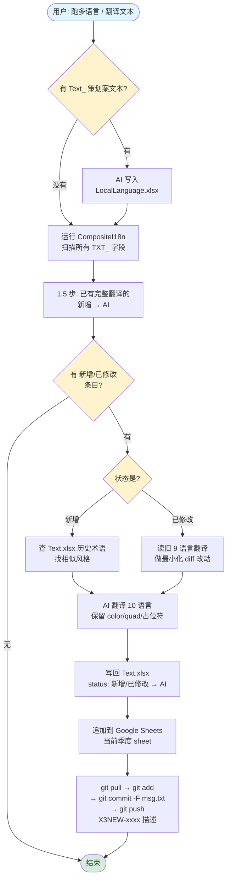

# x3-translation-automatic 使用说明

> 作者：gongliang

X3 多语言文本生成与翻译 skill。一句话：**扫描配置表 → AI 翻译 10 语言 → 写表 → git 提交**，一条龙。

---

## 1. 安装

把 `x3-translation-automatic` 整个文件夹拷到：

```
C:\Users\<你的用户名>\.claude\skills\x3-translation-automatic\
```

确保里面有 `SKILL.md` 和这份 `README.md`。

## 2. 环境准备

| 依赖 | 怎么搞 |
|------|--------|
| Python 3 | 自行安装 |
| Python 库 | `pip install xlrd==1.2.0 openpyxl xmltodict` |
| X3 配置 + 扫描脚本 | 从 git clone `x3gdconfig` 到本地（扫描脚本就在仓库 `Tools/gen_i18n/`，跟着分支版本化） |
| `gws` CLI | 已 `gws auth login` 认证（用于写 Google Sheets） |
| git 客户端 | 命令行 `git` 可用 |

> 📌 2026-05-15 起 X3 配置已从 SVN 迁到 git。旧路径 `E:\X3配置\data_dev` / `E:\X3本地化\dev\gen_i18n` **不要再用**。

## 3. 首次使用前告诉 AI 你的本地路径

skill 里有一个路径占位符 `X3_CONFIG_DIR` 需要你的实际值（默认 `E:\x3gdconfig`）。首次触发时直接告诉 AI：

> 我的 X3 配置仓库在 `E:\x3gdconfig`

建议让 AI 帮你存到 memory 里，以后自动加载不用重复填。

---

## 4. 文本类型区分（重要）

X3 多语言有**两种**文本来源，触发流程时务必知道你要处理的是哪种：

| 前缀 | 是什么 | 来源 | 处理方式 |
|------|--------|------|---------|
| **`TXT_`** | 配置表文本（英雄名、物品描述、任务文案等） | xlsx Row4 标注为 `TXT_` 的字段 | 扫描器**自动抓**，不用手填 |
| **`Text_`** | 策划案文本（新功能 UI 标题、按钮文字等） | 客户端代码硬编码读的 key | 你**先手动**写到 `LocalLanguage.xlsx`，再扫描 |

### 一句话记忆
- 大写 **TXT_** = 配置表里有 → 扫描器自己找
- 大小写混 **Text_** = 配置表里没有 → 先人工填到 LocalLanguage.xlsx
- 同一次任务两种经常都有（新功能往往配置表 + 策划案都加文本）

### 你怎么告诉 AI
- 只有 TXT_：直接说 "跑一下多语言" 就行
- 有 Text_：说 "新增 `Text_Mecha_NewFeature = 海妖新功能`，跑多语言"——AI 会先写 LocalLanguage 再扫

---

## 5. 完整流程图



---

## 6. 触发词

跟 Claude Code 说下面任一句都会自动触发：

- "跑一下多语言"
- "生成多语言"
- "导入文本"
- "扫描文本"
- "翻译 Text_xxx = 中文内容"
- "多语言提交"
- "更新 Text 表"

## 7. 修复已有翻译怎么办

不是新增，而是发现某条翻译错了，按问题层级走：

| 场景 | 特征 | 流程 |
|------|------|------|
| **翻译层 bug** | CN 正确，某外语翻错了 | 直接改 Text.xlsx 对应语言列，不扫描 |
| **配置层 bug** | CN 源文本身有错/歧义 | 先改配置表 CN → 扫描 → AI 重翻 → 提交 |

判定原则：**CN 对不对**就是分水岭。CN 对就只改翻译；CN 不对就先改配置。

---

## 8. 常见问题

**Q: 跑完发现某个文本一直被扫描器标"新增"，但 Text.xlsx 已经有完整翻译？**
A: skill 第 1.5 步会自动把这种已填满的"新增"改成"AI"。常见于 Tag 列纯数字 `1000%`、`FREE` 等所有语言相同的情况。

**Q: 客户端读出来文本里有 `\n` 字面字符，不是真换行？**
A: Text.xlsx 里换行就是存的字面 `\n`（两字符），不是真换行符。客户端会解析。**千万别**把它替换成真换行。

**Q: 提交时 git push 报 non-fast-forward？**
A: 别人在你这次操作期间也 push 到了 dev。先 `git pull --rebase` 把远端改动 rebase 进来，再 `git push`。如果是 xlsx 冲突，**绝不能整体覆盖**，要么人工 diff 要么重新跑一遍扫描+翻译。

**Q: gws append 报"命令行太长"？**
A: Windows cmd.exe 8K 限制，触发条件见 [SKILL.md](SKILL.md) 陷阱 3。Python 直调 node.exe + 分批（≤30 行/批）。

**Q: 扫描后 pending 里有 `{"typ":"lc","txt":"LC_XXX"}` 这种 JSON？**
A: 这是 LC 占位符（如 Fogfall 雾落系列），不能 AI 翻译。详见 [SKILL.md](SKILL.md) 陷阱 2，跳过即可。

**Q: 季度切换，Google Sheets 要换 sheet 怎么办？**
A: 改 [SKILL.md](SKILL.md) 第 5 步里的 `2025Q4` 为新季度（比如 `2026Q1`），团队共用一份。

---

## 9. 不放心可以先 dry run

第一次跑给陌生项目时，建议告诉 AI："只扫描不提交，让我看一眼 pending 列表"，确认翻译条目数符合预期再放行。
