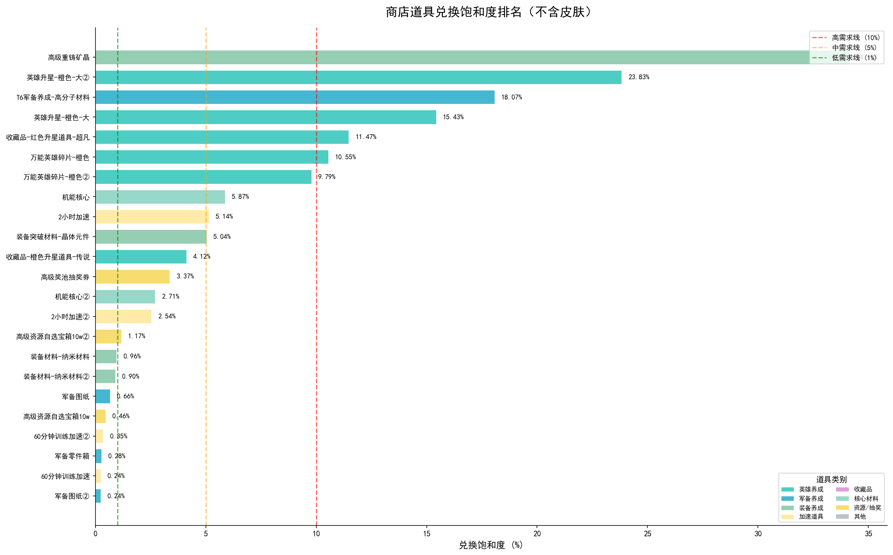
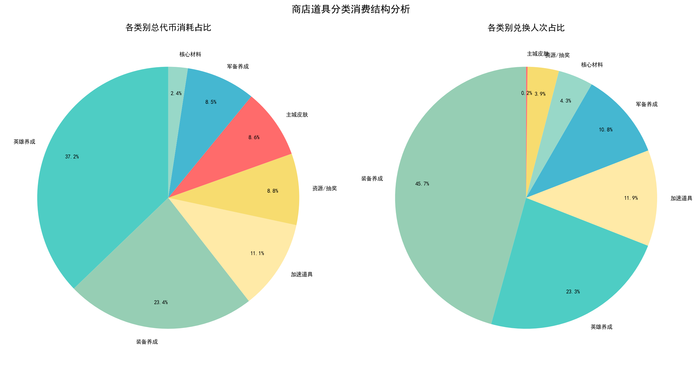
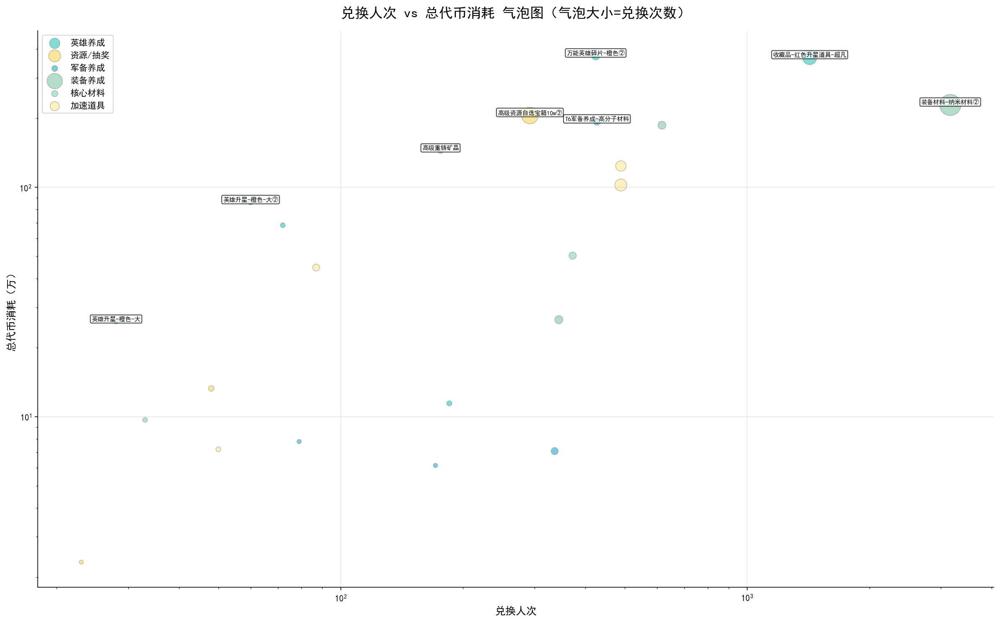
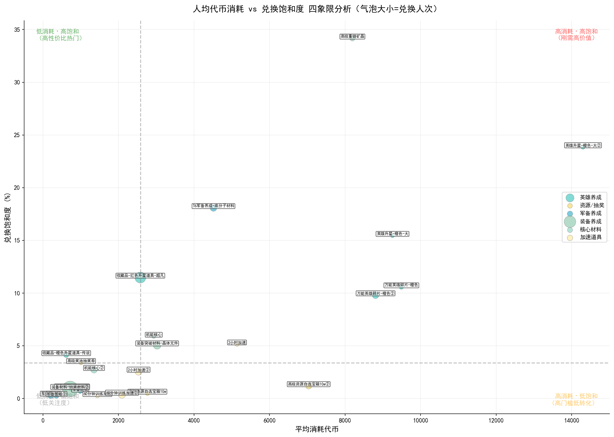
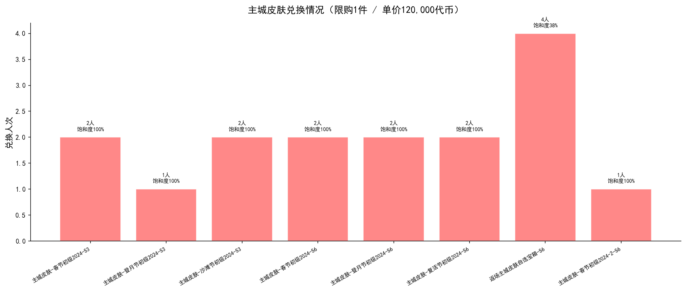

# 推币机活动 — 商店兑换数据深度分析报告

---

## 一、数据总览

| 指标 | 数值 |
|------|------|
| 商店道具总数 | 31 件 |
| 总代币消耗 | **25,081,065**（约 2,508 万） |
| 覆盖人次最高道具 | 装备材料-纳米材料② (3,161 人) |
| 兑换次数最高道具 | 装备材料-纳米材料② (57,131 次) |
| 饱和度最高（非皮肤） | 高级重铸矿晶 (34.15%) |

---

## 二、兑换饱和度分析

### 核心发现

**高饱和度道具（>10%）— 强刚需信号：**

| 道具 | 饱和度 | 单价 | 限购 | 分析 |
|------|--------|------|------|------|
| 高级重铸矿晶 | 34.15% | 800 | 30 | **最高饱和度**，限购仅30件叠加高单价，说明装备重铸需求极为刚性 |
| 英雄升星-橙色-大② | 23.83% | 1,200 | 50 | 高价高饱和，英雄升星为核心养成刚需 |
| T6军备养成-高分子材料 | 18.07% | 500 | 50 | T6 军备材料紧缺，427人争抢50个限购 |
| 英雄升星-橙色-大 | 15.43% | 1,200 | 50 | 与②版本一致，验证英雄升星的普遍性需求 |
| 收藏品-红色升星道具-超凡 | 11.47% | 150 | 150 | 1,425人参与，覆盖面广且饱和度高 |
| 万能英雄碎片-橙色 | 10.55% | 600 | 150 | 英雄碎片刚需稳定 |

**低饱和度道具（<1%）— 供过于求：**

| 道具 | 饱和度 | 限购 | 分析 |
|------|--------|------|------|
| 60分钟训练加速 | 0.24% | 9,999 | 限购极高，需求远未饱和 |
| 军备图纸② | 0.24% | 1,000 | 图纸供给充足 |
| 军备零件箱 | 0.28% | 5,000 | 极低饱和度，限购过于宽松 |
| 60分钟训练加速② | 0.35% | 9,999 | 同上 |
| 高级资源自选宝箱10w | 0.46% | 9,999 | 限购极高导致饱和度极低 |

---

## 三、代币消耗结构分析

### 各类别消耗占比

| 类别 | 代币消耗（万） | 占比 | 解读 |
|------|---------------|------|------|
| **英雄养成** | 933 万 | **37.2%** | 占比第一，验证英雄成长是最核心的代币消耗方向 |
| **装备养成** | 586 万 | 23.4% | 第二大消耗，装备突破+重铸需求旺盛 |
| **加速道具** | 278 万 | 11.1% | 加速类虽单价低但兑换量巨大 |
| **资源/抽奖** | 221 万 | 8.8% | 高级资源宝箱+抽奖券贡献 |
| **主城皮肤** | 216 万 | 8.6% | 单价极高（12万），极少人购买但单品消耗大 |
| **军备养成** | 214 万 | 8.5% | 军备材料需求分散 |
| **核心材料** | 60 万 | 2.4% | 机能核心占比最小 |

**关键结论：** 英雄养成 + 装备养成 合计占代币消耗的 **60.6%**，是商店的绝对消耗主力。

---

## 四、兑换人次 vs 代币消耗分析

### 象限分析

- **高人次·高消耗（右上角）：** 装备材料-纳米材料②（3,161人/228万代币）为覆盖最广、消耗最大的单品
- **低人次·高消耗（左上角）：** 英雄升星类道具，少数高R玩家大量消耗
- **高人次·低消耗（右下角）：** 军备零件箱等低价道具，覆盖广但消耗低
- **低人次·低消耗（左下角）：** 部分冷门道具

---

## 五、四象限定位分析

### 道具定位矩阵

| 象限 | 特征 | 典型道具 | 运营建议 |
|------|------|----------|----------|
| **高消耗·高饱和** | 刚需高价值 | 英雄升星、高级重铸矿晶 | 核心吸金道具，可适当提高限购 |
| **低消耗·高饱和** | 高性价比热门 | 收藏品-红色升星道具 | 覆盖广但变现效率低，可考虑调价 |
| **高消耗·低饱和** | 高门槛低转化 | 2小时加速、资源宝箱 | 人均消耗高但渗透不够，需降低门槛 |
| **低消耗·低饱和** | 低关注度 | 军备零件箱、训练加速 | 存在感低，考虑捆绑销售或调整限购 |

---

## 六、皮肤道具专项分析

### 发现

- 所有限购1件的皮肤 **饱和度均为 100%**，说明有需求的玩家全部完成了购买
- 购买人数极少（1-2人/款），属于 **极高R值玩家的专属消费**
- 单价 120,000 代币，8款皮肤 + 1个自选宝箱，合计消耗约 **216 万代币**
- 返场自选宝箱（限购4件）饱和度 37.5%，说明高R玩家对历史皮肤有选择性补充需求

---

## 七、运营优化建议

### 1. 限购调整建议

| 道具 | 当前限购 | 饱和度 | 建议 |
|------|----------|--------|------|
| 高级重铸矿晶 | 30 | 34.15% | **提高至 50-80**，释放强刚需 |
| 英雄升星-橙色-大 | 50 | 15-24% | **提高至 80-100**，英雄养成核心资源 |
| T6军备养成-高分子材料 | 50 | 18.07% | **提高至 80**，高端军备需求大 |
| 60分钟训练加速 | 9,999 | 0.24% | **降低至 500-1000**，减少冗余感 |
| 军备零件箱 | 5,000 | 0.28% | **降低至 1000-2000** |

### 2. 定价策略建议

- **英雄碎片/升星类**：维持当前价格，作为核心消耗锚点
- **加速类道具**：考虑推出"加速礼包"（捆绑 2 小时+60 分钟），提高客单价
- **军备类低饱和道具**：可适当降低单价或增加兑换返利，提升渗透率

### 3. 商品结构建议

- 当前商品结构偏重 **养成材料**，可增加 **趣味性/社交性** 道具（如头像框、聊天气泡等）
- 皮肤类可增加 **中端价位皮肤**（如 30,000-60,000 代币），扩大购买群体
- 高饱和度道具说明代币产出与消耗平衡点偏低，可适度 **提高活动代币产出** 以刺激更多消费

---

*分析报告生成时间：2026-02-13*
